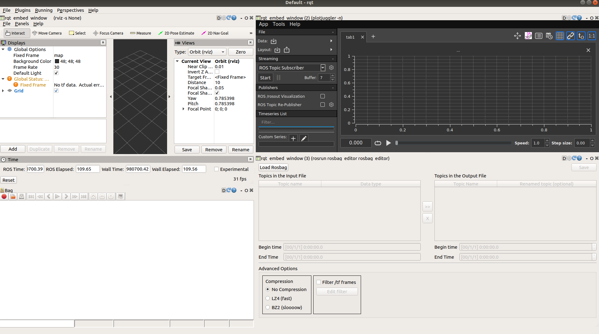
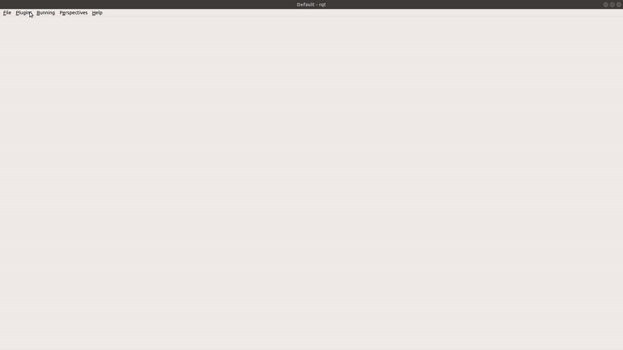

# rqt_embed_window

Embed any graphical program window into a rqt_ plugin. The ultimate productivy tool!

Notable examples of applications that are embeddable with `rqt_embed_window`:



* [Plotjuggler](https://www.plotjuggler.io) Helping the awesome [@facontidavide](https://github.com/facontidavide) to be able to use it alongside [Rviz](https://github.com/facontidavide/PlotJuggler/issues/87)/[Rqt](https://github.com/facontidavide/PlotJuggler/issues/5) as some people requested.
* [Rviz](http://wiki.ros.org/rviz) Works without crashes unlike [rqt_rviz](http://wiki.ros.org/rqt_rviz) [Issue #6](https://github.com/ros-visualization/rqt_rviz/issues/6). (The main motivation for this work).
* [rosbag_editor](https://github.com/facontidavide/rosbag_editor) Another seriously awesome tool by [@facontidavide](https://github.com/facontidavide).

Other maybe useful or fun ones:
* Google Chrome (if you have an already existing web interface)
* VLC
* Slack
* Wireshark
* SimpleScreenRecorder
* Visual Studio Code
* Some games like Slay the Spire
* Another instance of rqt_gui


# Usage



Open `rosrun rqt_gui rqt_gui`, go to `Plugins` > `Miscellaneous Tools` > `Embed a graphical program window into RQT`.

You'll be prompted for the commandline for the program (which will be executed in the plugin), for example `rviz -s None`.

**Note**: Doing `-s None` disables the splashscreen, which is **necessary** to get the correct PID and Window ID internally.

You can export your perspective and load it later as any other.

## Things that didn't work for me
terminator, gnome-terminal, LibreOffice, kivy-based apps


## How to try if an app works quickly
Use the `test_if_window_can_be_embedded.py` script providing it the PID of the window you want to test.

You can find the PID by means of `ps aux | grep program-name` or `pstree -p` and look for the process that inherits the rest.

You can also use `xwininfo` and click on the window and manually modify the script to use the window id provided.

## Workarounds for complex commands/programs
If your program needs a long set of parameters or environment variables, set it up in a bash
script and call it from rqt_embed_window, however, you must make sure to prepend the binary with `exec` so the PID reported to rqt_embed_window is the actual PID of the program itself and not the
shell that is executing it.

## Useful examples

Find here suggestions of commands that may be useful (these are to be added in the popup of the plugin).

### Run rviz with a config file
```bash
rviz --splash-screen None --display-config my_rviz_config.rviz
```

### Run plotjuggler
```bash
plotjuggler --nosplash --layout my_layout
```

### Run rosbag_editor
```bash
rosrun rosbag_editor rosbag_editor
```

# Thanks

Thanks to [@leggedrobotics](https://github.com/leggedrobotics), specially [@samuelba](https://github.com/samuelba), for the [catkin_create_rqt](https://github.com/leggedrobotics/catkin_create_rqt) package which made cooking the first version of this package quick and painless.

